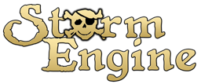

# Scripting System Overview
_[back to Index](../index.md)_



**Related articles**: TBD

Upon startup, the game (`ENGINE.exe`) will attempt to load and compile the game logic located in `program` directory. These "scripts" are written in C using the game's API, and compiled at runtime using the built-in compiler. 

## `Program/` File Structure

Each folder inside `program` is roughly responsible for its own area of interest as indicated below. In practice, they also serve as databases for related areas of interest: thus, `characters` will contain all the information and logic related to characters, `items` will have all the stats on items, etc. 

Please note that these do not include any other media than text: all the animations, models, textures, sounds, UI layouts, sounds and videos are located in the `resource` directory. 

The following list is sorted alphabetically and is based on the latest build of _Sea Dogs: To Each His Own_. Because the contents largely define each game, they differ from one title to another.

* `program\` - shared and startup code.
* `program\battle_interface\` - UI logic on land and sea, quick travel.
* `program\BIManager\` - Battle Interface manager.
* `program\cannons\` - cannon generation and game logic.
* `program\characters\` - NPC generation and game logic: faces, names, spawn locations, etc.
* `program\colonies\` - definition of each colony default values.
* `program\controls\` - keybindings and related functionality.
* `program\dialogs\` - quests and conversation logic.
* `program\encounters\` - events on the land and sea.
* `program\interface\` - generic UI logic.
* `program\islands\` - island and city generation: trade/black market data, fort, various locations, etc.
* `program\items\` - everything item-related: types, descriptions, usage...
* `program\loc_ai\` - NPC AI behavior in any situation.
* `program\locations\` - location maps, loading NPC, etc.
* `program\nations\` - nations generation and definitions (relationships et al.)
* `program\net\` - multiplayer module (currently inactive)
* `program\questBook\` - all the journal entries.
* `program\quests\` - quest event handlers, various related modules.
* `program\scripts\` misc. game logic (rumours, sieges, duels, bounty hunters, etc.)
* `program\sea_ai\` - Player and AI behaviour on sea.
* `program\ships\` - ships generation and definitions.
* `program\store\` - merchants logic and database (items, prices, etc.)
* `program\weather\` - weather system definitions and usage.
* `program\worldMap\` - everything world map related.

## Typing

In order to be compiled, the scripting files should contain good C-like code. This also means that the variables should be strongly typed. Commonly used are base C types: `int`, `float`, but also `bool` and a simple to use `string`. Any custom structs are supported in the form of `object`s. Last, arrays are supported of the above.

### Base Types

There're three base types in scripting language: 

* `int`: a signed 32-bit integer

``` C++
syntax: 
	int var_name;
examples:
	int GameTime = -2053; // OK
	int FreeSlots = 75;   // OK
```

* `float`: a single-precision floating-point number. Because there're no `double`s, specifying `f` at the end is not required but allowed. 

``` C++
syntax: 
	float var_name;
examples:
	float WindSpeed = 2.0;         // OK
	float WindDirection = -0.0057; // OK
	float ShipDirection = 3.14f;   // OK
```

* `bool`: a logical `true`/`false` operator where `true` is any non-zero value and `false` is zero.

``` C++
syntax: 
	bool var_name;
examples:
	bool IsSpeaking = true;                  // OK
    bool IsDrunk = (AlcoholInBlood > 10.0f); // OK
    bool KilledAtLeastOneEnemy = KillCount;  // OK where KillCount is an int
```

### Strings

In the scripting code, strings are sequences of characters of arbitrary length. You can concatenate multiple strings together using `+` operator. 

``` C++
syntax: 
	string var_name;
example:
	string Name = "John";                    // OK
    string LastName = GetRandomLastName();   // OK, e.g. "Jameson"
    string FullName = Name + " " + LastName; // OK, "John Jameson"
```

### Arrays

The scripting code allows fixed-size arrays of any type. This means that, after being initialized, the length of the array cannot be modified. However, unlike in C, the array _may_ be initialized from a variable. In that case, the array size would be that variable's value at the array creation time. 

``` C++
syntax: 
    var_type var_name[int number_of_elements];
example:
	int Characteristics[10];                // OK
	string CharacteristicsNames[10];        // OK

	int array_size;
	array_size = 10;
	string CharacteristicsNames[array_size]; // Also OK
```

// TODO(yakvi): Add info from array.txt

### Objects, References and Attributes

An `object` is a treelike text structure of an arbitrary shape. This means that it can store any amount of fields in _text_ form, even if specifying a number without quotes is allowed.

The strings may be converted back to `int` or `float` using `sti` and `stf` functions. 

``` C++
syntax:
    object object_name;
example:
    object Sky;
    Sky.State = "sunset";
    Sky.Size = "10";
    Sky.Angle = "25.0f";

    int skyAngle = stf(Sky.Angle); // 25.0f
    float skySize = sti(Sky.Size); // 10
```

Objects can also be accessed by reference, defined as `ref`. Usually it's useful if you need to access a specific object inside the array. 

In order to create a reference, `makeref` call must be made. After `ref` has been created, usage syntax is identical to object usage.

``` C++
syntax:
    object obj_name;
    ref ref_name;
    makeref(ref, obj);
example:
    object SkyStates[SKY_STATES_N];
    ref Sky;
    int n = 0;

    // iterate over all sky states    
    makeref(Sky, SkyStates[n]);
    Sky.State = "sunset";
    Sky.Size = "10";
    Sky.Angle = "25.0f";
    n++;
    // rinse and repeat
```

Finally, you can access a single attribute of an object using an _attribute_, or `aref`, variable. Similarly to the `ref`, `makearef` call must be made to store the attribute. Since each object can store multiple objects, `aref`s can be quite helpful. 

``` C++
syntax:
    obj obj_name;
    aref aref_name;
    makearef(aref, obj);
example:
    object Item;
    aref  ItemType;

    Item.type = "sword";

    makearef(ItemType, Item.type);
```

If you are accessing an attribute via a variable, you should put that variable inside brackets:

``` C++
example:
    aref aSky;
    string attribute = "d20";
    aSky.Dir.d20 = "NNE";         // OK
    aSky.Dir.(attribute) = "NNE"; // OK
    aSky.Dir.attribute = "NNE";   // Error
```


---

| [Home](../index.md) | [Site Map](../site-map.md) | 